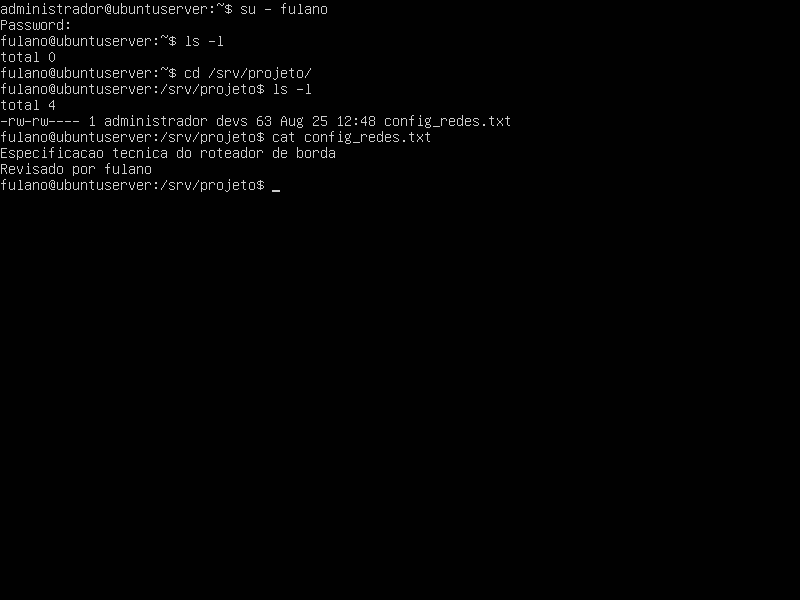
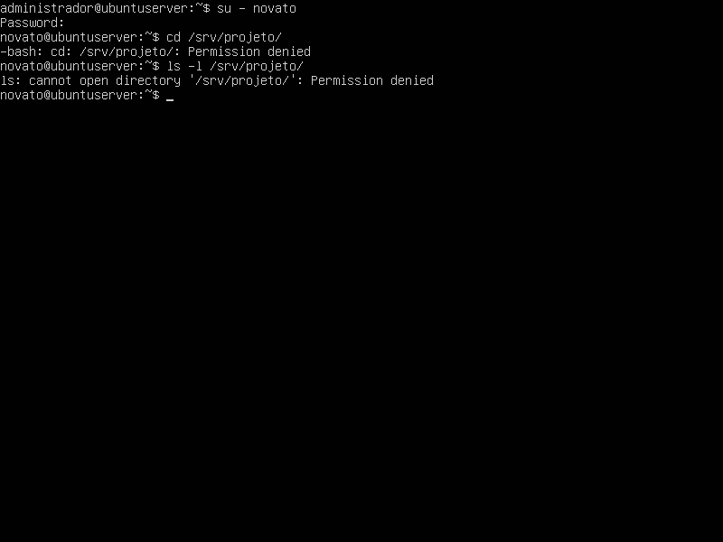

# Relatório Técnico: Aula Prática 02 - Administração de Usuários, Grupos e Permissões no Linux

## 1. Identificação
* **Título da prática:** Aula 02: Administração de Usuários, Grupos e Permissões no Linux
* **Nome completo do aluno:** Matheus Willian do Nascimento Oliveira
* **Matrícula:** 2023002369
* **Curso:** Sistemas de Informação
* **Turma:** 2023.1
* **Data de realização:** 12/08/2026

---

## 2. Objetivo
Validar a capacidade de administrar contas de usuários, organizar equipes em grupos de trabalho e configurar permissões de acesso em arquivos e diretórios no Ubuntu Server. A prática focou na utilização de utilitários como `adduser`, `usermod`, `chown`, `chgrp` e `chmod` para implementar políticas de segurança que garantam o isolamento adequado das informações.

---

## 3. Ambiente
* **Sistema Operacional Hospedeiro (Host):** Linux Mint
* **Hardware Físico:** Processador AMD Ryzen 5 5600GT, 16 GB de Memória RAM DDR4 (3200 MHz), Placa-mãe ASUS TUF Gaming A520M-Plus
* **Hipervisor:** Oracle VM VirtualBox versão 7.1.18r173720
* **Sistema Operacional Convidado (Guest):** Ubuntu Server (imagem ISO `ubuntu-22.04.5-live-server-amd64.iso`) configurado com 2048 MB de RAM e 32 GB de armazenamento em disco.

---

## 4. Procedimento
O processo de administração e configuração de permissões seguiu as seguintes etapas:

1. **Criação de Contas de Usuários:** Foram criados quatro novos usuários no sistema (`fulano`, `cicrano`, `beltrano` e `novato`) utilizando o comando `sudo adduser`, gerando pastas pessoais automáticas no diretório `/home` e definindo senhas locais para cada um.
2. **Criação e Gestão de Grupos:** Criou-se o grupo de trabalho `devs` através do comando `sudo groupadd`. Em seguida, utilizou-se o utilitário `sudo usermod -aG devs` para associar os usuários `fulano`, `cicrano` e `beltrano` a este grupo. O usuário `novato` foi intencionalmente mantido fora do grupo para atuar como um perfil externo.
3. **Criação do Diretório Compartilhado:** Com permissões elevadas, criou-se a pasta raiz de desenvolvimento em `/srv/projeto`.
4. **Definição de Propriedade:** Alterou-se o dono do diretório para `administrador` utilizando o comando `sudo chown` e o grupo proprietário para `devs` utilizando o comando `sudo chgrp`.
5. **Configuração de Permissões Restritas:** Aplicou-se a política de segurança através da notação octal com o comando `sudo chmod 770 /srv/projeto`. Isso concedeu controle total (Leitura, Escrita e Execução) ao dono (`administrador`) e aos membros do grupo (`devs`), bloqueando completamente o acesso de outros usuários do sistema.
6. **Desafio Prático (Exercício de Fixação):** Em um passo adicional, criou-se o grupo `financeiro`, e os usuários `cicrano` e `beltrano` foram adicionados a ele. A pasta `/srv/financeiro` foi configurada para pertencer ao usuário `administrador` e ao grupo `financeiro`. As permissões aplicadas permitiram a navegação e edição apenas para os membros competentes, gerando falhas de acesso (`Permission denied`) ao testar a entrada com usuários externos ao setor (`fulano` e `novato`).

---

## 5. Testes e Validação

### Teste A  

  

### Teste B

  

### Criação de pasta `financeiro` por usuário `fulano`

  

### Tentativa de acesso a pasta por `fulano`

  

### Tentativa de acesso a pasta por `novato`

---

## 6. Problemas e soluções

Durante a execução dos passo, não foram encontrados problemas.

---

## 7. Conclusão
A correta administração de usuários, grupos e permissões é o pilar central da segurança e da integridade em servidores Linux. Através da prática, ficou evidente como a combinação da política de propriedade com o controle de permissões baseada na notação octal implementa o princípio do menor privilégio. Negligenciar a configuração correta da dos diretórios pode resultar no vazamento de informações sigilosas, edição indevida de configurações e exposição de falhas de segurança.