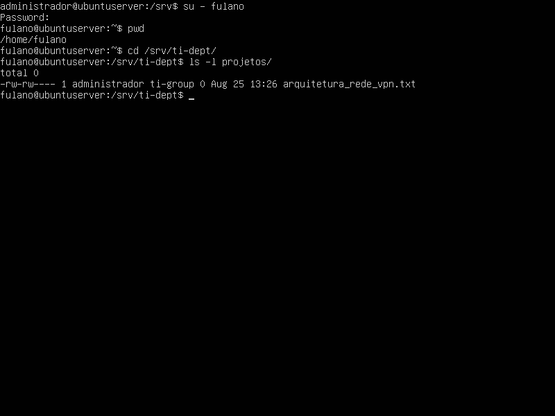
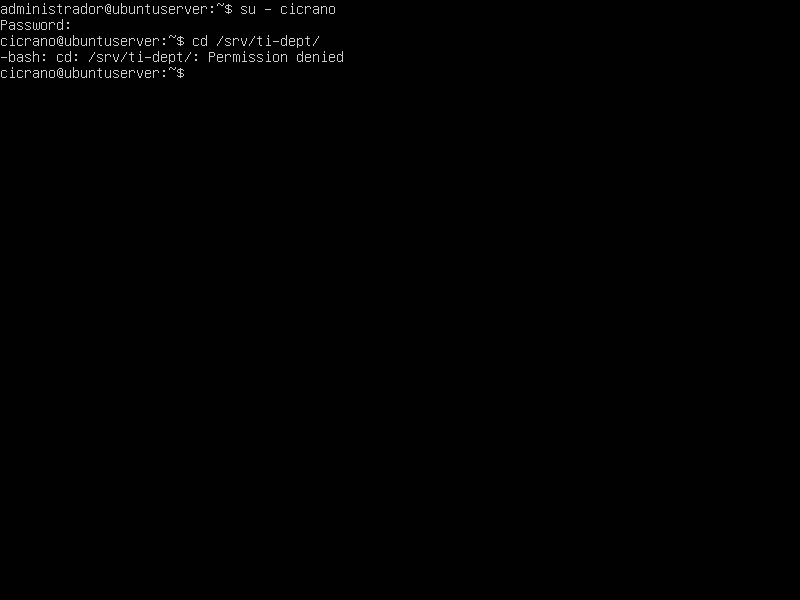

# Relatório Técnico: Aula Prática 03 - Estrutura FHS e Permissões Avançadas no Linux Server

## 1. Identificação
* **Nome completo:** Matheus Willian do Nascimento Oliveira
* **Matrícula:** 2023002369
* **Turma:** 2023.1
* **Data da prática:** 12/08/2026

---

## 2. Objetivo
A prática teve como foco explorar a árvore padrão de diretórios do Linux (Filesystem Hierarchy Standard - FHS). Foram exercitados conceitos de navegação entre os principais diretórios do sistema, a criação de pastas aninhadas com o comando `mkdir -p` e o uso de permissões octais para aplicar políticas de isolamento departamental em ambientes corporativos.

---

## 3. Ambiente
* **Sistema Operacional Guest:** Ubuntu Server (ISO: ubuntu-22.04.5-live-server-amd64)
* **Hardware Virtual:** 1 vCPU, 2048 MB de RAM e 32 GB de disco.
* **Diretório de Trabalho Padrão da Prática:** Pastas de serviço dentro do caminho `/srv`.

---

## 4. Procedimento
1. **Inspeção de Pastas do FHS:** O roteiro iniciou com a exploração do `/etc` (focado em configurações) e a visualização de logs do sistema na pasta `/var/log`.
2. **Criação de Diretórios Departamentais:** Utilizando o comando `sudo mkdir -p`, foram criadas as pastas `/srv/ti-dept/projetos` e `/srv/vendas-dept/relatorios` simultaneamente, facilitando a construção da estrutura de departamentos.
3. **Gerenciamento de Grupos Departamentais:** 
   * Criaram-se os grupos `ti-group` e `vendas-group` através do `groupadd`.
   * Os usuários foram alocados nos seus departamentos com o `usermod -aG` (o usuário `fulano` em TI e o `cicrano` em Vendas).
4. **Aplicação de Permissões e Restrições (Modo Octal):**
   * Com o `chown`, definimos que o usuário `administrador` e os grupos departamentais criados seriam os donos legais das pastas no `/srv`.
   * Definimos o `chmod 770` para garantir que apenas donos e membros das equipes tivessem controle de navegação, leitura e escrita, restringindo os demais (Outros) de qualquer visualização.
5. **Criação de Arquivos (Desafio Prático):** Utilizamos o mesmo princípio do roteiro para criar o grupo `diretoria-group`, alocar o usuário `beltrano` nele e definir permissões de isolamento restrito na pasta `/srv/diretoria-dept`.

---
## 5. Testes e Validação

### Teste A  

### Teste B

  

---

## 6. Problemas e Soluções
Durante a execução dos comandos desta aula prática, a sequência dos procedimentos e os acessos de usuário fluíram conforme o esperado pelo roteiro. Não foram encontrados erros de sintaxe ou de permissão, e o sistema respondeu corretamente aos testes de bloqueio, dispensando a necessidade de soluções de contorno ou resolução de problemas.

---

## 7. Conclusão
O domínio do padrão de hierarquia (FHS) e da manipulação de propriedades de arquivos no Linux são habilidades que garantem o controle da infraestrutura. A prática demonstrou que a segurança real não depende apenas de bons firewalls, mas também depende essencialmente de restrições de permissões nos arquivos internos. Isolando as pastas de cada grupo com permissão nula para usuários não autorizados, é possível se prevenir o acesso e alteração indevida de dados importantes entre departamentos.